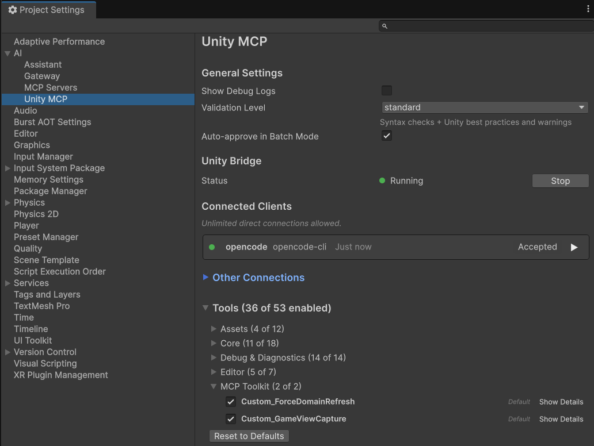

# Unity MCP Toolkit

A community-driven collection of custom MCP tools that extend Unity's official MCP integration. Each tool adds editor automation capabilities that AI coding agents can use to interact with the Unity Editor.

## Tutorial

<a href="https://youtu.be/f4xIUiy0D9s"></a>

Learn how to build your own custom MCP tools for Unity from scratch. This video covers the `[McpTool]` attribute, parameter records with `[McpDescription]`, and common pitfalls that prevent tools from showing up.

**[Watch the tutorial](https://youtu.be/f4xIUiy0D9s)** | **[Get the code](https://github.com/gamedev-resources/unity-mcp-custom-tools-tutorial)**

## Requirements

- **Unity 6+** (`6000.0` or later)
- **[Unity AI Assistant](https://docs.unity3d.com/Packages/com.unity.ai.assistant@2.0/manual/index.html)** (`com.unity.ai.assistant` 2.4.0-pre.1 or later) — this is a pre-release package

### Optional Dependencies

- **[Input System](https://docs.unity3d.com/Packages/com.unity.inputsystem@1.0/manual/index.html)** (`com.unity.inputsystem` 1.0.0 or later) — required for Input System tools.
- **[Recorder](https://docs.unity3d.com/Packages/com.unity.recorder@5.0/manual/index.html)** (`com.unity.recorder` 5.0.0 or later) — required for Recorder tools.

## Installation

Add the following to your project's `Packages/manifest.json`:

```json
{
    "dependencies": {
        "com.whatupgames.unity-mcp-toolkit": "https://github.com/yecats/unity-mcp-toolkit.git"
    }
}
```

Or use **Window > Package Manager > + > Add package from git URL** and enter:

```
https://github.com/yecats/unity-mcp-toolkit.git
```

## Tools

### General

| Tool | Type | Default | Description |
|---|---|---|---|
| `McpToolkit.GetToolkitInfo` | Read | On | Returns information about the Unity MCP Toolkit plugin, including version and a categorized list of all available tools with their enabled status. AI agents should call this first to discover toolkit capabilities. |
| `McpToolkit.GameViewCapture` | Read | On | Captures the Game View as a base64-encoded PNG. Supports a resolution multiplier (1-4x). Accounts for OS display scaling. Works in Edit and Play mode. |
| `McpToolkit.ForceDomainRefresh` | Action | On | Forces a domain reload even when the Unity Editor is not in the foreground. Use after modifying scripts externally to trigger recompilation without switching to Unity. |

### Project Settings

| Tool | Type | Default | Description |
|---|---|---|---|
| `McpToolkit.GetPlayerSettings` | Read | On | Reads project identity, rendering, scripting configuration, and platform settings. |
| `McpToolkit.SetPlayerSettings` | Write | Off | Modifies player settings (company name, color space, scripting backend, defines, etc.). |
| `McpToolkit.GetQualitySettings` | Read | On | Reads all quality levels with shadow, AA, VSync, LOD, and rendering properties. |
| `McpToolkit.SetQualitySettings` | Write | Off | Modifies quality settings for a specific or active quality level. |
| `McpToolkit.GetPhysicsSettings` | Read | On | Reads 3D and 2D physics settings (gravity, solver iterations, queries, etc.). |
| `McpToolkit.SetPhysicsSettings` | Write | Off | Modifies 3D and 2D physics settings. |
| `McpToolkit.GetTimeAndAudioSettings` | Read | On | Reads time (fixed timestep, time scale) and audio (sample rate, voices) settings. |
| `McpToolkit.SetTimeAndAudioSettings` | Write | Off | Modifies time and audio settings. |
| `McpToolkit.GetScriptExecutionOrder` | Read | On | Reads scripts with custom execution order. |
| `McpToolkit.SetScriptExecutionOrder` | Write | Off | Sets execution order for a MonoScript by class name. |

### Build

| Tool | Type | Default | Description |
|---|---|---|---|
| `McpToolkit.GetBuildSettings` | Read | On | Reads build target, development/debug/profiler flags, scenes in build, installed platforms, and compilation defines. |
| `McpToolkit.SetBuildSettings` | Write | Off | Toggles dev build, debugging, profiler flags. Manages scenes in build (add, remove, enable, disable, reorder). Excludes platform switching and build execution for safety. |

### Scene View

| Tool | Type | Default | Description |
|---|---|---|---|
| `McpToolkit.GetSceneViewCamera` | Read | On | Reads Scene View camera pivot, rotation, zoom, projection, 2D mode, gizmos, lighting, grid, draw mode, and camera settings. |
| `McpToolkit.SetSceneViewCamera` | Write | Off | Modifies Scene View camera properties. Supports LookAt (world point) and FrameGameObject (frame by name) actions. |

### Input System

*Requires `com.unity.inputsystem` 1.0.0+. Tools appear automatically when the package is installed.*

| Tool | Type | Default | Description |
|---|---|---|---|
| `McpToolkit.GetInputActions` | Read | On | Lists all Input Action Assets with action maps, actions, bindings, and control schemes. Supports summary or detailed view per asset. |
| `McpToolkit.SetInputActions` | Write | Off | Modifies Input Action Assets: add/remove action maps, actions, and bindings. Supports wholesale JSON replacement. |

### Recorder

*Requires `com.unity.recorder` 5.0.0+. Tools appear automatically when the package is installed.*

| Tool | Type | Default | Description |
|---|---|---|---|
| `McpToolkit.GetRecorderSettings` | Read | On | Reads the Recorder configuration: session settings (frame rate, record mode, frame/time interval), all configured recorders with type-specific properties, and current recording state. |
| `McpToolkit.SetRecorderSettings` | Write | Off | Modifies Recorder configuration. Supports session-level settings and recorder list management: add, remove, enable, disable, or modify recorders (Movie, Image Sequence, Audio, Animation Clip). |
| `McpToolkit.StartRecording` | Action | Off | Starts a recording session using the current Recorder configuration. Automatically enters Play mode. |
| `McpToolkit.StopRecording` | Action | Off | Stops any active recording session. Output files are written when the recording stops. |

## Managing Tools

You can toggle individual MCP Toolkit tools on and off in **Edit > Project Settings > AI > Unity MCP > Tools**. Tools are organized into collapsible groups:

- **MCP Toolkit** — General tools (GetToolkitInfo, GameViewCapture, ForceDomainRefresh)
- **MCP Toolkit - Project Settings** — All project settings read/write tools
- **MCP Toolkit - Build** — Build configuration tools
- **MCP Toolkit - Scene View** — Scene View camera tools
- **MCP Toolkit - Input System** — Input Action tools
- **MCP Toolkit - Recorder** — Recorder configuration and recording tools

Write tools are **disabled by default** and must be explicitly enabled by the user.



## Conditional Compilation

Some tools depend on optional Unity packages (Input System, ProBuilder, Timeline, NavMesh). The toolkit uses `versionDefines` in the assembly definition combined with `#if` preprocessor guards so these tools compile only when their package is installed. When the package is absent, Unity silently ignores the missing assembly reference and the guarded code is excluded from compilation. The tools are completely invisible — they don't appear in the MCP settings UI and the registry never sees them.

| Package | Symbol | Min Version |
|---------|--------|-------------|
| `com.unity.inputsystem` | `MCP_TOOLKIT_INPUT_SYSTEM` | 1.0.0 |
| `com.unity.recorder` | `MCP_TOOLKIT_RECORDER` | 5.0.0 |

Future optional subsystems (ProBuilder, Timeline, NavMesh) will follow the same pattern. See the Input System files under `Editor/Tools/InputSystem/` for a working reference.

## Contributing

This toolkit is meant to grow over time with tools the community finds useful. If you have an idea for a tool that would make your workflow better, chances are others would benefit from it too. Contributions are welcome and encouraged!

Please keep the following in mind:

- **Follow the Unity convention for file structure.** Tool logic goes in `Editor/Tools/<Subsystem>/`, parameter records are co-located with their tools. One file per tool, one file per params record.
- **Optional package dependencies:** If your tool depends on a package that might not be installed, wrap the entire `.cs` file in `#if MCP_TOOLKIT_<PACKAGE>` / `#endif` and add both a `references` entry and a `versionDefines` entry to `McpToolkit.Editor.asmdef`. See the Input System tools for the exact pattern.
- **AI-assisted contributions are welcome**, but a human must review the code and PR description before submitting. PRs that appear to be 100% vibe-coded without human review will be sent back.

## License

This project is dedicated to the public domain under the [CC0 1.0 Universal](LICENSE) license. You can copy, modify, and distribute it without asking permission or giving credit.
